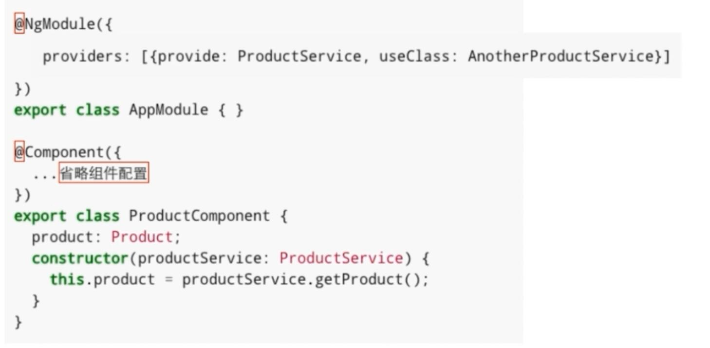
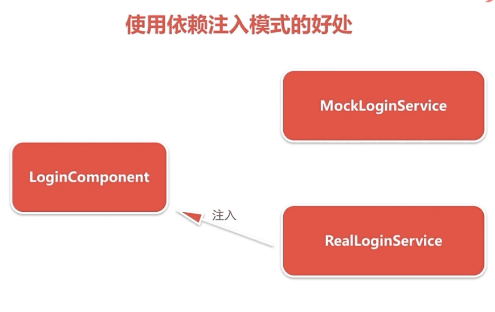

# angular study

2017-11-21
 依赖注入

#### How to start this project
```javascript
npm install
npm start
``` 

#### remark
学习内容
1. 什么是依赖注入模式及使用依赖注入的好处
2. 介绍Angular的依赖注入实现：注入器和提供器
3. 注入器的层级关系

依赖注入：Dependency Injection 简称 DI
控制反转：Inversion of Control 简称 IOC

```javascript
var product = new Product();
createShipment(product);
```




### 注入器
```javascript
constructor(private productService:ProductService){}
```
### 提供器
```javascript
provider:[ProductService]
provider:[{provide:ProductService,useClass:ProductService}]
provider:[{provide:ProductService,useClass:AnotherProductService}]
provider:[{provide:ProductService,useFactory:()=>{...}}]
```

##路由
名称 | 简介 
---- | ------ 
Routes | 路由配置，保存着哪个URL对应展示哪个组件，以及在哪个RouterOutlet中展示组件
RouterOutlet | 在Html中标记路由内容呈现位置的占位符指令
Router | 负责在运行时执行路由的对象，可以通过调用其navigate()和navigateByUrl()方法来导航到一个指定的路由
RouterLink | 在Html中声明路由导航用的指令
ActivatedRoute | 当前激活的路由对象，保存着当前路由的信息，如路由地址，路由参数等 
###在路由时传递数据
1. 在查询参数中传递数据
eg:
```javascript
/product?id=1&name=2   =>  ActivatedRoute.queryParams[id]

```
2. 在路由路径中传递参数
eg:
```javascript
{path:/product/id}   => /product/1  =>  ActivatedRoute.params[id]
```
3. 在路由配置中传递数据
eg:
```javascript
{path:/product,component:ProductComponent, data:[{isProd:true}]}   =>  ActivatedRoute.data[0][isProd]
```

###重定向路由
在用户访问一个特定的地址时，将其重定向到另一个指定的地址
eg：
```javascript
www.aaa.com    =>    www.aaa.com/products
www.aaa.com/a    =>    www.aaa.com/y
```
###子路由
```javascript
{path: 'home',component:HomeComponent}

{path: 'home',component:HomeComponent,
    children:[
        {
            path:'',component:XxxComponent
        },
        {
            path:'/yyy',component:YyyComponent
        }
    ]
}
```
###辅助路由
```html
<router-outlet></router-outlet>
<router-outlet name="aux"></router-outlet>
```
```javascript
{path: 'xxx', component: XxxComponent, outlet: 'aux'}
{path: 'yyy', component: YyyComponent, outlet: 'aux'}
```
```html
<a [routerLink]="[{outlets: {aux: 'xxx'}}]">Xxx</a>
<a [routerLink]="[{outlets: {aux: 'yyy'}}]">Yyy</a>
```
###路由守卫
+ 只有当用户已经登录并拥有某些权限时才能进入某些路由
+ 一个由多个表单组件组成的向导，例如注册流程，用户只有在当前路由的组件中填写了满足要求的信息才可以导航到下一个路由
+ 当用户未执行保存操作而试图离开当前导航时提醒用户

1. CanActivate：处理导航到某路由的情况
2. CanDeactivate：处理从当前路由离开的情况
3. Resolve: 在路由激活之前获取路由数据

## AngularProjectPlus

This project was generated with [Angular CLI](https://github.com/angular/angular-cli) version 1.4.4.

## Development server

Run `ng serve` for a dev server. Navigate to `http://localhost:4200/`. The app will automatically reload if you change any of the source files.

## Code scaffolding

Run `ng generate component component-name` to generate a new component. You can also use `ng generate directive|pipe|service|class|guard|interface|enum|module`.

## Build

Run `ng build` to build the project. The build artifacts will be stored in the `dist/` directory. Use the `-prod` flag for a production build.

## Running unit tests

Run `ng test` to execute the unit tests via [Karma](https://karma-runner.github.io).

## Running end-to-end tests

Run `ng e2e` to execute the end-to-end tests via [Protractor](http://www.protractortest.org/).

## Further help

To get more help on the Angular CLI use `ng help` or go check out the [Angular CLI README](https://github.com/angular/angular-cli/blob/master/README.md).
