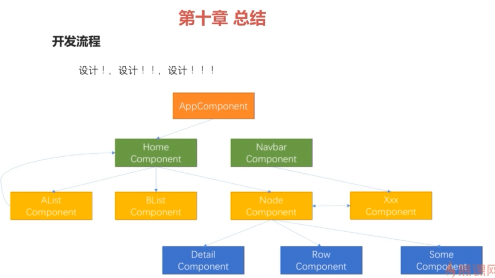

# angular study

2017-11-22
 

#### How to start this project
```javascript
npm install
npm start
``` 

#### remark
数据绑定
* 使用插值表达式将一个表达式的值显示在模版上
```javascript
<h1>{{productTitle}}</h1>
```
* 使用方括号将HTML标签的一个属性绑定到一个表达式上
```javascript

```

* __使用小括号将组件控制器的一个方法绑定为模版上一个事件的处理器__
```javascript
<button (click)="toProductDetail()">商品详情</button>
```

```javascript
<button (click)="saved = true">
```

_默认是单向绑定_


## Project

This project was generated with [Angular CLI](https://github.com/angular/angular-cli) version 1.4.4.

## Development server

Run `ng serve` for a dev server. Navigate to `http://localhost:4200/`. The app will automatically reload if you change any of the source files.

## Code scaffolding

Run `ng generate component component-name` to generate a new component. You can also use `ng generate directive|pipe|service|class|guard|interface|enum|module`.

## Build

Run `ng build` to build the project. The build artifacts will be stored in the `dist/` directory. Use the `-prod` flag for a production build.

## Running unit tests

Run `ng test` to execute the unit tests via [Karma](https://karma-runner.github.io).

## Running end-to-end tests

Run `ng e2e` to execute the end-to-end tests via [Protractor](http://www.protractortest.org/).

## Further help

To get more help on the Angular CLI use `ng help` or go check out the [Angular CLI README](https://github.com/angular/angular-cli/blob/master/README.md).
